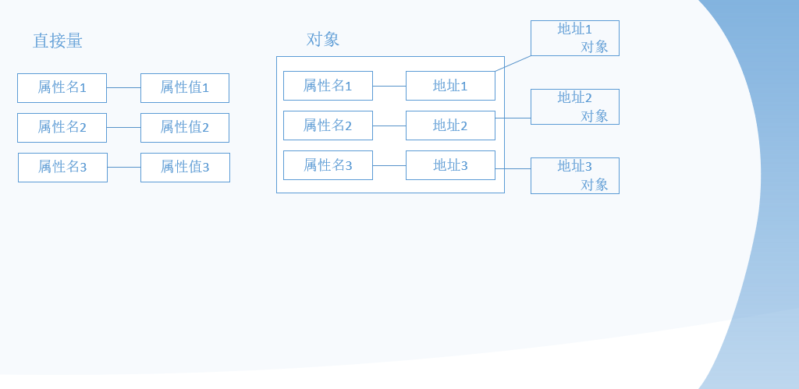

## 什么是直接量

直接量是指不需要创建对象就可以直接使用的变量。ES中的直接量主要有三种类型：表示字符串的string类型、表示数字的number类型和表示true/false的boolean类型。当我们直接将值赋给变量后，ES就会自动判断其类型，而且当参数发生变化后，其类型也会自动跟着变化，即ES时一种弱类型的语言。
直接量直接使用两块内存来保存它们的名值对，而不像对象类型需要3块内存。

## 直接量的封包与解包
ES中有一种叫做自动封包/解包的功能, 类似```.net/java```中的装箱/拆箱，其作用时在程序执行过程中按照需要自动在直接量和其对象的对象类型间进行转化。将直接量转换为对应的对象进行处理叫封包，反过来，将对象转换为直接量叫解包。

代码示例：

```javascript
var m = new Number(5);
var n = m + 2;

console.log(n); // 7
console.log(typeof m); // object
console.log(typeof n); // number
```

## 直接量的包装对象
直接量所对应的对象叫做包装对象，string、number、boolean所对应的包装对象分别是String、Number、Boolean对象。它们都是function类型的对象。
一个对象最重要的就是它所包含的属性，而function对象的属性又分为两大类，一类是它自身的属性，另一类是它所创建的object类型实例对象的属性，创建的实例对象的属性又分为实例自己的属性和function的prototype的属性。

## String对象
String对象是function类型的对象，对应的是字符串类型，可用来创建字符串类型的object类型，例如： new String('abc');
### String自身的属性
String类型自身只有两个属性，一个prototype,另一个是fromCharCode。fromCharCode方法的作用是创建由Unicode值所对应的字符组成的字符串，需要一个或多个参数。
代码示例：

```javaScript
var s = String.fromCharCode(97,98,99);
console.log(s); // abc
```

### String.prototype中的属性
* constructor: 默认指向Stirng对象本身
* toString： 重写了toString方法，所以字符串的toString不会返回[object, Obejct]
或者[object, String]而是返回字符串本身的值。
代码示例：

```javascript
var s = new String('Hello World');
console.log(s.toString()); // Hello World
```

* valueOf: 返回字符串本身
代码示例：

```javascript
var s = new String('Hello World');
console.log(s.valueOf()); // Hello World
```
* charAt: 这个方法用来获取指定位置的字符，序号从0开始
代码示例：
```javascript
var s = new String('Hello World');
console.log(s.charAt(3)); // l
```
* charCodeAt: 这个方法和charAt类似，但它获取的是Unicode值。
代码示例：
```javascript
var s = new String('aHello World');
console.log(s.charCodeAt(0)); // 97
```
* concat: 这个方法可以将多个字符串连接在一起组成一个新字符串。此时s并不会有变化。
代码示例：
```javascript
var s = 'hello';
var s1 = s.concat(' world');
console.log(s1); // hello world
```
* indexOf: 这个方法用来查找指定的字符或者字符串，它有两个参数，第一个参数是要查找的字符或字符串；第二个参数可选，代表查找的起始位置，如果省略，默认从第一个字符开始查找
代码示例：
```javascript
var s = 'hello world';

console.log(s.indexOf('l')); // 2
console.log(s.indexOf('or')); // 7
```
* lastIndexOf: 这个方法与indexOf的用法一样，不同之处在于： indexOf是从前往后找，而lastIndexOf是从后往前找，并且lastIndexOf的第二个参数position的作用是指定查找的字符串的结束位置（从0开始计数）
代码示例：
```javascript
var s = 'hello world';

console.log(s.lastIndexOf('l')); // 9, 注意：这里是9， 下面的是3
console.log(s.lastIndexOf('l', 3)); // 3
```
* localeCompare： 这个方法的作用是使用本地化方式比较字符串，类似于>、<的作用，但是>、<只能依据Unicode编码来比较字符串的大小，而有些地区的字符顺序和Unicode编码并不一样，这是就需要使用localeCampare方法来比较。
代码示例：
```javascript
console.log('a'.localeCompare('b')); // -1
console.log('b'.localeCompare('a')); // 1
console.log('a'.localeCompare('a')); // 0
```
* match: 这个方法用于匹配指定的内容，如果传入的参数为字符串，则会匹配字符串，如果传入的是正则表达式，则会返回于正则表达式相匹配的内容：
代码示例：
```javascript
console.log('hello javaScript'.match('Script')); // ["Script"]
console.log('hello'.match('Script')); // null 
console.log('hello javaScript'.match(/script/i)); // ["Script"]
console.log('hello javaScript'.match(/a+/g)); // ['a','a']
```
* replace： 这个方法用来将字符串中指定的内容替换为新内容，要替换的内容可以是字符串也可以是正则表达式。默认只会替换第一个符合条件的内容，使用正则表达式可以使用g来替换全部符合条件的内容。replace不会改变原来对象的值，而是返回新的对象。
代码示例：
```javascript
var a = 'beneficial';

console.log(a.replace('e', 'E')); // bEneficial
console.log(a.replace(/e/, 'E')); // bEneficial
console.log(a.replace(/e/g, 'E')); // bEnEficial
```
* slice: 这个方法用于截取字符串的一部分，它有两个参数，分别表示要截取的字符串的起始位置和结束位置，如果大于0， 则从前面技术，如果小于0，则从后面计数，如果省略第二个参数，则会截取到字符串的末尾。slice也不会改变原来的字符串。
代码示例：
```javascript
var s = 'hello ECMAScritpt';
console.log(s.slice(6, 10)); // ECMA
console.log(s.slice(6, -7)); // ECMA
console.log(s.slice(6)); // ECMAScritpt
```
* substring: 这个方法和slice类似，也是截取字符串中的一部分，它有两个参数，分别表示要截取的字符串的起始位置和结束位置，所不同的是substring中结束位置在起始位置之前，则会自动将其调换后再截取，当参数小于0时会按0处理。substr方法虽然在主流浏览器中可以使用，但并不是标准里的方法，随时可能被舍弃，不建议使用。
代码示例：
```javascript
var s = 'hello ECMAScritpt';
console.log(s.substring(6, 10)); // ECMA
console.log(s.substring(10, 6)); // ECMA
console.log(s.substring(6)); // ECMAScritpt
console.log(s.substring(-5)); // hello ECMAScritpt
```
* split： 这个方法用于按照指定分隔符将字符串转换为字符串数组。split方法有两个参数，第一个参数时分隔符，如果不为空则使用它来分割字符串，如果为空则按照字符分割字符串；第二个参数可选，表示需要返回数组中元素的个数，如果省略则将分割后的元素全部返回。
代码示例：
```javascript
var s = 'hello world';
console.log(s.split(" ")); // [ 'hello', 'world' ]
console.log(s.split(" ", 1)); // [ 'hello' ]
console.log(s.split()); // [ 'hello world' ]
```
* toLowerCase: 这个方法的作用是将字符串转换为小写形式
代码示例：
```javascript
var s = 'Hello World';
console.log(s.toLowerCase()); // hello world
```

* toLocaleLowerCase: 使用本地语言将字符串转换为小写
代码示例：
```javascript
var s = 'Hello World';
console.log(s.toLocaleLowerCase()); // hello world
```
* toUpperCase/toLocaleUpperCase: 同转换小写的方式，将字符串转换成大写。

* trim： 去掉字符串头部和尾部的空格：
代码示例：
```javascript
var s = ' Hello World    ';
console.log(s.trim()); // Hello World
```

### String创建的对象实例的属性
* length属性和类似于数组，属性名为0到length-1,属性值为序号所对应的字符：
代码示例：
```javascript
var s = new String('Hello World');
console.log(s.length); // 11
console.log(s[0]); // H
```

## Number对象
Number对象是function类型的对象，对应的是数字类型，可用来创建数字类型的object对象。
### Number自身的属性
* prototype：原型对象
* MAX_VALUE: 用来表示最大的数，其值约为1.7976931348623175*10^308
* MIN_VALUE: 用来表示最小数， 约为5*10^-324
* NaN: Not a Number缩写
* NEGATIVE_INFINITY:表示负无穷大
* POSITIVE_INFINITY: 表示正无穷大

### Number.prototype属性
* constructor: 这个属性默认指向Number对象本身
* toString： Number的prototype重写了toString方法，重写后的toString方法会返回数字的字符串形式，还可以指定要转换为数字的基数，即指定几进制，默认十进制。
代码示例：
```javascript
var n = 11;
console.log(n.toString()); // 11
console.log(n.toString(2)); // 1011
console.log((255).toString(16)); //ff
```
* toLocaleString: 这个方法会按照数字的本地表示法来输出
代码示例：
```javascript
var n = 5201314; 
console.log(n.toLocaleString()); // 5,201,314
console.log(n.toLocaleString('zh-Hans-CN-u-nu-hanidec')); // 五,二〇一,三一四
```
* valueOf: 返回数字的直接量
代码示例：
```javascript
var n = new Number(520);
console.log(typeof n); // object
console.log(typeof n.valueOf()); // number
```
* toFixed: 这个方法用来指定数字的精度，即保留几位小数。它的参数为要保留小数的位数，如果不指定则按0处理，即没有小数，并且它会按需要自动进行四舍五入。
代码示例：
```javascript
console.log(123.456.toFixed()); // 123
console.log(123.456.toFixed(2)); // 123.46
console.log(123.456.toFixed(5)); // 123.45600
console.log(13.14e5.toFixed(6)); // 1314000.00000
```
* toExponential: 此方法的作用是将数字转换为科学计数法来表示，有一个可选参数，表示保留小数的位数，如果省略参数，则将输出尽可能多的数字。
代码示例：
```javascript
console.log(123.456.toExponential()); // 1.23456e+2
console.log(123.456.toExponential(2)); // 1.23e+2
```
* toPrecision: 这个方法用于将数字格式话为指定位数（包括整数和小数）。如果指定的位数小于数字的整数部分，那么将使用科学计数法来表示。
代码示例：
```javascript
console.log(123.456.toPrecision(4)); // 123.5
console.log(123.456.toPrecision(2)); // 1.2e+2
```
### Number创建的示例对象的属性
Number创建的实例对象没有自己的命名属性。

## Boolean对象
Boolean对象是function类型的对象，对应的是布尔类型，可用来创建布尔类型的object实例对象。
### Boolean自身的属性
只有一个prototype属性

### Boolean.prototype的属性
Boolean的prototype一共有三个属性： constructor、toString和valueOf。constructor指向Boolean本身，toString和valueOf都返回实例对象的值，但它们类型不一样，toString返回的string类型，而valueOf返回boolean类型。
代码示例：
```javascript
var b = new Boolean(true);

console.log(b.toString());  // 'true'
console.log(b.valueOf()); // true

console.log(typeof b); // object
console.log(typeof b.toString()); // stirng
console.log(typeof b.valueOf()); // boolean
```

## 多知道点： 如何在浏览器中产看对象的属性
代码示例：
```javascript
// 获取String对象自身的属性
console.log(Object.getOwnPropertyNames(String));
// ["length", "name", "prototype", "fromCharCode", "fromCodePoint", "raw"]


// 获取String的prototype的属性
console.log(Object.getOwnPropertyNames(String.prototype));
// ["length", "constructor", "anchor", "big", "blink", "bold", "charAt", "charCodeAt", 
// "codePointAt", "concat", "endsWith", "fontcolor", "fontsize", "fixed", "includes", 
// "indexOf", "italics", "lastIndexOf", "link", "localeCompare", "match", "matchAll", 
// "normalize", "padEnd", "padStart", "repeat", "replace", "search", "slice", "small", 
// "split", "strike", "sub", "substr", "substring", "sup", "startsWith", "toString", 
// "trim", "trimStart", "trimLeft", "trimEnd", "trimRight", "toLocaleLowerCase", 
// "toLocaleUpperCase", "toLowerCase", "toUpperCase", "valueOf"]

// 获取String创建的对象实例的属性
console.log(Object.getOwnPropertyNames(new String()));
// ["length"]
```
