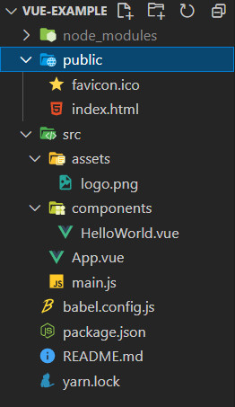

#### 第一步：安装vue-cli
```
npm install -g @vue/cli
```
检测是否安装成功 vue -V:
```
$ vue -V
@vue/cli 4.5.6
```

#### 第二步：初始化项目vue create project-name
```
// project name: ui
 vue create ui
```
###### 如果选择Manaually， 会让你选择一些组件(注意这里如果选择vue 3，会创建最为纯洁的vue项目)

这里选择的Manualy select features:


#### 第三步： 运行项目 yarn serve(浏览器手动输入：localhost:8080)后期可配置webpack,自动打开浏览器


打开项目查看vue版本：


项目地址：https://github.com/956159241/PersonalBlog

目前项目搭建好了，接下来对项目做一个简单的了解。
目录结构如下：

main.js是入口文件，```createApp(App).mount('#app')```将vue挂载到index.html的```<div id="app"></div>```上面。
App.vue是第一个也是最外层的组件，里面嵌套了一个HelloWorld组件。

简单看下App.vue的文件内容：
```html
<template>
  
  <HelloWorld msg="Welcome to Your Vue.js App"/>
</template>

<script>
import HelloWorld from './components/HelloWorld.vue'

export default {
  name: 'App',
  components: {
    HelloWorld
  }
}
</script>

<style>
#app {
  font-family: Avenir, Helvetica, Arial, sans-serif;
  -webkit-font-smoothing: antialiased;
  -moz-osx-font-smoothing: grayscale;
  text-align: center;
  color: #2c3e50;
  margin-top: 60px;
}
</style>
```
这个基本就是vue组件的大致模块分布，在接下来的章节中，会对组件以及一些vue提供的api做一个详细的了解。
