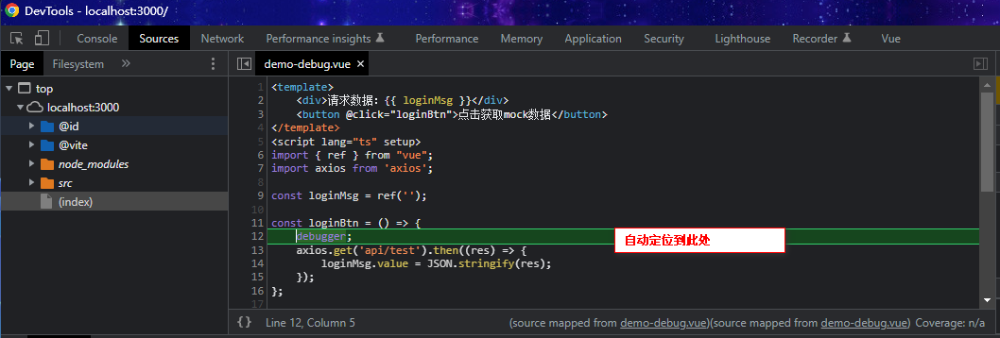
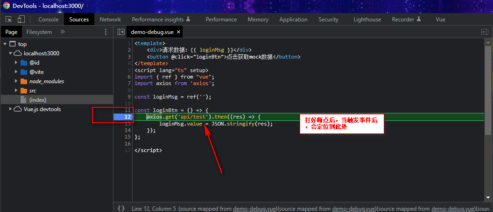
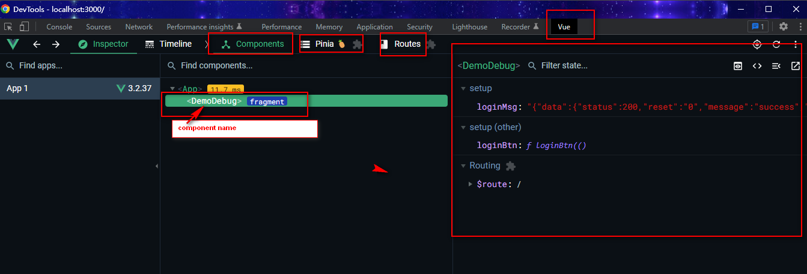
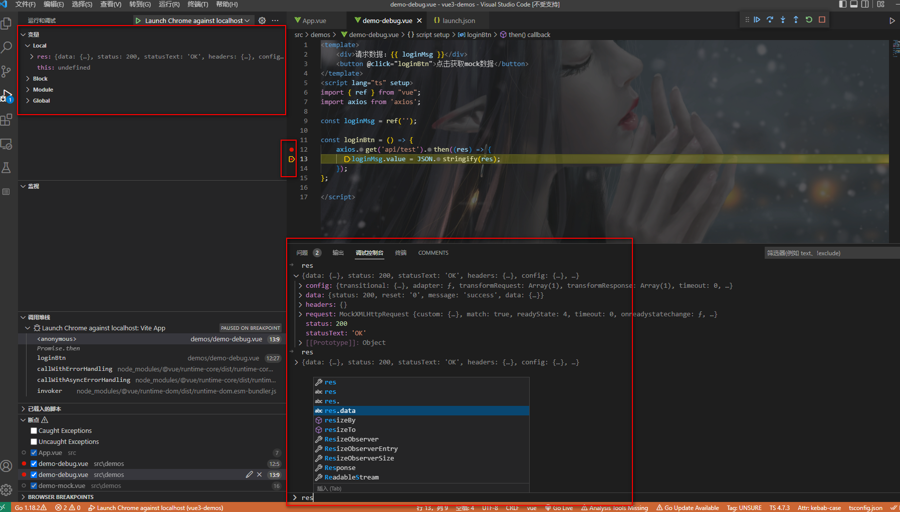

## 如何对vue3项目进行调试
调试是开发过程中必备的一项技能，掌握了这项技能，可以很好的定义bug所在。一般在开发vue3项目时，有三种方式。
* 代码中添加```debugger;```
* 使用浏览器调试：sourcemap需启用
* vs code 调试：先开启node服务，后启用vs code的调试模式

具体使用如下：
## debugger调试法
当打开开发者模式时才会起作用(F12), 但是使用完之后将其删除，不然遗留在代码中，不利于自己与他人开发。一般配置文件，也不允许其出现，.eslintrc.json, rules: ```"no-debugger":"error"```

```javascript
<template>
    <div>请求数据：{{ loginMsg }}</div>
    <button @click="loginBtn">点击获取mock数据</button>
</template>
<script lang="ts" setup>
import { ref } from "vue";
import axios from 'axios';

const loginMsg = ref('');

const loginBtn = () => {
    debugger;
    axios.get('api/test').then((res) => {
        loginMsg.value = JSON.stringify(res);
    });
};

</script>
```


## 浏览器调试法
在浏览器中调试是最常见的一种方式，即使部署了代码，只要将sourcemap打开（vite.config.ts->build->```sourcemap: true,```）即可。一般生产环境会将其关闭。

我们在开发vue3的时候， 如果借用浏览器调试的话，需要安装一个浏览器插件：vue developtools。

这里仅说明如何调试与vue3相关的，其他还有关于dom/css等相关的调试修改，不在此处赘述。

具体使用如下：
### 调试JS代码
找到source中的文件，提前打好断点，然后触发事件：


### 调式vue3组件
如果想看vue3各个组件的prop，data，pinia数据等，这里就需要借用vue developtools插件了。在这里，我们也可以对components中的数据进行修改，也会触发界面的重新渲染。


## vs code调试法
 &rarr; 启动项目服务
 &rarr; 启动vs code调试(F5)
 &rarr; Wab App(Chrome) 
 &rarr; 修改配置文件, launch.json
 **这里的url里面的端口，就是启动服务的端口**
```json
{
    // 使用 IntelliSense 了解相关属性。 
    // 悬停以查看现有属性的描述。
    // 欲了解更多信息，请访问: https://go.microsoft.com/fwlink/?linkid=830387
    "version": "0.2.0",
    "configurations": [
        {
            "type": "pwa-chrome",
            "request": "launch",
            "name": "Launch Chrome against localhost",
            "url": "http://localhost:3000",
            "webRoot": "${workspaceFolder}/src",
            "sourceMaps": true,
        }
    ]
}
```
 &rarr; F5, 启动调试
这时会重新打开一个浏览器并打开当前的服务。

 &rarr; 在vs code中打断点，在浏览器中使用触发事件。

 