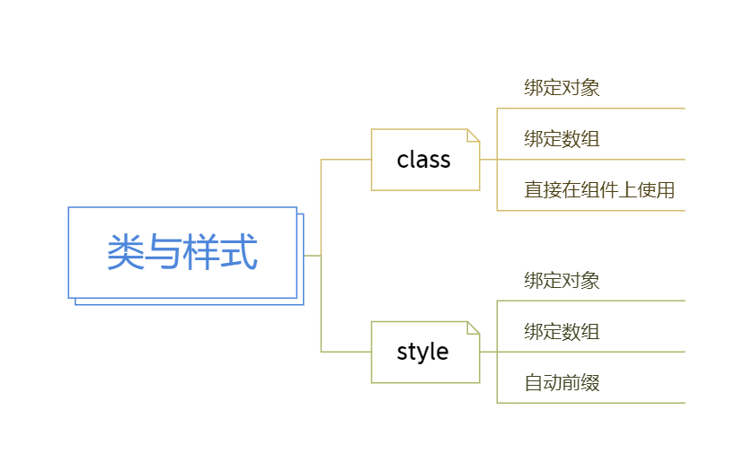

在 Vue3开发中，我们经常需要对元素的类和样式进行动态控制。本文将详细介绍如何使用 Vue.js 的特性来实现这一目标。

## class 绑定

### 绑定对象：
在 Vue.js 中，我们可以使用对象语法来绑定 class。例如：

```html
<div :class="{ active: isActive }"></div>
```

这段代码表示当 isActive 变量为 true 时，会添加 active 类。这是一种非常灵活的方式，可以让我们根据数据状态轻松地切换 class。

### 绑定数组：
除了对象语法外，我们还可以使用数组语法来绑定多个 class。例如：
```html
<div :class="[activeClass, staticClass]"></div>
```
这里 activeClass 和 staticClass 是两个变量，它们分别对应要添加的 class 名称。

## style 绑定

### 绑定对象：
:style 支持绑定 JavaScript 对象值，对应的是 HTML 元素的 style 属性：

```html
const activeColor = ref('red')
const fontSize = ref(30)

<div :style="{ color: activeColor, fontSize: fontSize + 'px' }"></div>
```

### 绑定数组：
我们还可以给 :style 绑定一个包含多个样式对象的数组。这些对象会被合并后渲染到同一元素上：
```html
<div :style="[baseStyles, overridingStyles]"></div>
```

### 自动前缀：
Vue.js 提供了一种方便的方式来处理 CSS 前缀问题。只需在 style 标签上添加 scoped 属性即可自动添加浏览器兼容性前缀。例如：

```css
<style scoped>
  .my-class {
    display: flex;
  }
</style>
```
这样，在编译过程中，Vue.js 就会自动为我们生成带有各种浏览器前缀的样式规则。

总结：

通过以上介绍，我们可以看出 Vue.js 在处理类与样式的绑定方面提供了很多便利。无论是单个 class 还是多个 class，都可以通过简单的语法来实现动态控制；同时，对于样式的问题，Vue.js 也提供了解决方案，使得我们在开发过程中无需过多考虑兼容性问题。