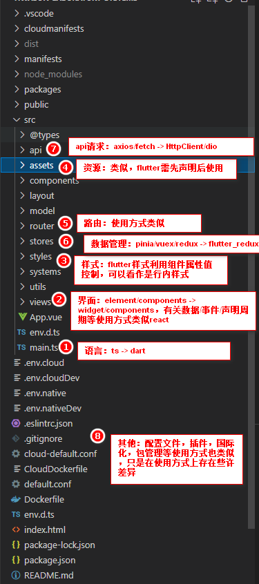
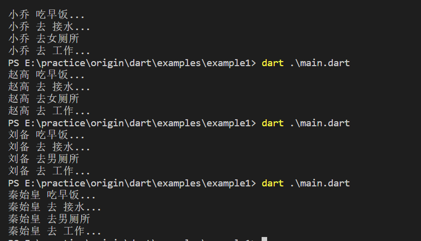

## 简介
一套代码库，即可构建、测试和发布适用于**移动、Web、桌面和嵌入式**平台的精美应用。
就目前来看：该技术是很好的技术，生态发展得也很快，但是毕竟flutter3才推出不久，flutter提供的api和周边生态可能只能应对一些相对简单的场景，复杂的场景还需要自己造轮子，自己去探索（可能有未知的坑）。

移动端：优点相较于混合开发就是性能有很大的提升且适配程度更好一些，可以和原生相媲美。缺点就是上手复杂，且需要造轮子和探索。
web：相较于SPA，基本没有什么有点，开发/调试/生态等都不如现有的开发模式。
桌面：相较.net桌面开发，api支持程度还不够。
嵌入式：未接触

综上：目前来看，在移动端有优势（性能和更好的跨平台适配），日后也很有可能成为主流，毕竟有google这个大后台。其次就是一套代码，多平台运行的优势（在代码中，不同平台特有的功能还是需要不同平台对应的api）。

## 安装
* 安装 flutter sdk（内含dart sdk）
* 更新环境变量（flutter/国内镜像）
* 设置android开发环境
* 设置windows开发环境

校验环境命令：```flutter doctor```

参考地址：
安装方式：https://flutter.cn/docs/get-started/install/windows
镜像选择：https://flutter.cn/community/china

## 概览
从前端开发角度出发来看flutter的组成部分

* 语言：由dart开发
* 界面：由widge组成，里面也包含样式，事件，声明周期等特性
* 资源：字体资源，图片资源等
* 路由：控制界面跳转
* 数据管理：flutter_redux(小项目应该用不到)
* api请求：httpclient/dio
* 其他：配置，插件，包管理等

## Dart语言
针对语言的学习，先不管api的学习，先看简介后看基础的语言语法。
#### 简介
Dart是一种面向对象的语言（强类型），具有C语言风格的语法，可以选择将它编译成JavaScript。它支持各种编程辅助工具，如：接口，类，集合，泛型和可选类型。
#### 基础语法
* 变量和运算符（与其他语言类似）
  *  定义变量方式：var/const/final
  *  数据类型：数字、字符串、布尔、列表（类似数组）、集合、映射、符文、符号
  *  运算符 + - * /等
* 类，类似class语法
* 函数
  * ```void main(List<String> args) { var name = 'zzh'; xxxxx.... }```
  * ```int main(List<String> args) { var name = 'zzh'; xxxx...., return 1; }```

* 决策与循环结构
  * if, if...else, else if, switch...case
  * for, for...in, while, do...while, break, continue
* 注解
  * 注解是一种可以为代码提供一些语义信息或元数据的标注，这在其他语言中也很常见，在dart中常见的注解有@deprecated、@override等，注解是以@开头的，他们可以作用于类，函数，属性等
* 库和包
  * https://dart.cn/guides/libraries
  * https://dart.cn/guides/packages
* 异步
  * Dart是一种单线程编程语言
  * Dart使用Future对象来表示异步操作

#### 示例
描述：今天第一个来的同事(共10个同事)，吃了早饭，接了水，然后去了趟厕所后，回到座位上开始工作。
colleague.dart
```dart
// 新建一个同事类
class Colleague {
  // 类属性声明
  late String name;
  late int age;
  late int sex;

  // 普通构造函数
  Colleague(String name, int age, [int sex = 1]) {
    this.name = name;
    this.age = age;
    this.sex = sex;
  }

  goto(String place) {
    print('$name 去 $place...');
  }

  eat(bool breakfast) {
    if (breakfast) {
      print('$name 吃早饭...');
    } else {
      print('$name 吃午饭 or 晚饭');
    }
  }

  wc() {
    sex == 1 ? print('$name 去男厕所') : print('$name 去女厕所');
  }
}
```
main.dart
```
import 'colleague.dart';
import 'dart:math';

void main(List<String> args) {
  var colleagures = [
    new Colleague('秦始皇', 18, 1),
    new Colleague('秦二世', 18, 1),
    new Colleague('赵高', 18, 2),
    new Colleague('李斯', 18, 1),
    new Colleague('刘邦', 18, 1),
    new Colleague('大乔', 18, 2),
    new Colleague('小乔', 18, 2),
    new Colleague('曹操', 18, 1),
    new Colleague('刘备', 18, 1),
    new Colleague('袁绍', 18, 1),
  ];

  var random = new Random();
  var ranIndex = random.nextInt(10);
  var colleagure = colleagures[ranIndex]; // 随机进来的第一个同事

  colleagure.eat(true); // 吃早饭
  colleagure.goto('接水');
  colleagure.wc();
  colleagure.goto('工作');
}
```


参考地址：
Dart开发预览：https://dart.cn/guides/language/language-tour
dart官网(中文)： https://dart.cn/
pub.dev: https://pub.flutter-io.cn/

## 界面（UI组件）


参考地址：
flutter官网（中文）：https://flutter.cn/
《Flutter实战 第二版》：https://book.flutterchina.club/
dart官网(中文)： https://dart.cn/
pub.dev: https://pub.flutter-io.cn/