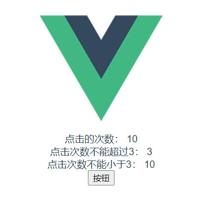

## 插值
在使用vue定义模板时，双大括号（Mustache语法）“{{}}”是最基本的文本插值的方法，它会自动将我们的数据实时显示出来。例如在上一节的示例中，```点击的次数： {{ count }}```这里的count就是绑定了data里面的count， 当点击按钮改变count时，界面也会随之变化。
```html
<template>
    <div class="container">
        初始值是： {{ initCount }}
        点击的次数： {{ count }}
        <button @click="clickBtn">按钮</button>
    </div>
</template>

<script>
export default {
    props: ['initCount'],
    data() {
        return {
            count: 0
        }
    },
    methods: {
        clickBtn() {
            this.count++;
        }
    }
}

</script>

<style scoped>
button {
    color: red;
    border: 1px solid #909090;
}
</style>
```
#### 多种插值方法
除了上面的在“{{}}”声明变量，也可以写表达式，或者是方法，具体使用如下：

```html
<template>
    <div class="container">
        <div>点击的次数： {{ count }}</div>
        <div>点击次数不能超过3： {{ count > 3 ? 3 : count }}</div>
        <div>点击次数不能小于3： {{ getCount() }}</div>
        <button @click="clickBtn">按钮</button>
    </div>
</template>

<script>
export default {
    data() {
        return {
            count: 0
        }
    },
    methods: {
        clickBtn() {
            this.count++;
        },
        getCount() {
            return this.count < 3 ? 3 : this.count;
        }
    }
}
</script>
```
## 过滤器(Vue2.0)
###### 过滤器在Vue3.0中已经被移除，故仅做简单的了解即可。
在插值的时候，有时需要对插入的值进行格式化，例如字母改大写，货币千位使用逗号等，这时就需要使用过滤器的功能。vue支持在“{{}}”插值的尾部添加一个管道符“|”对数据进行过滤。过滤器可以串联，而且可以接受参数。
例如：
```javascript
// 串联
{{message | filterA | filterB}}
```

```javascript
// 接收参数, arg1和arg2分别传给过滤器的第二个和第三个参数，第一个参数是数据本身。
{{message | filterA('arg1', 'arg2')}}
```

###### 注意
过滤器适用与简单的转换，如果要实现复杂的数据变换，应该适用计算属性（computed）。


